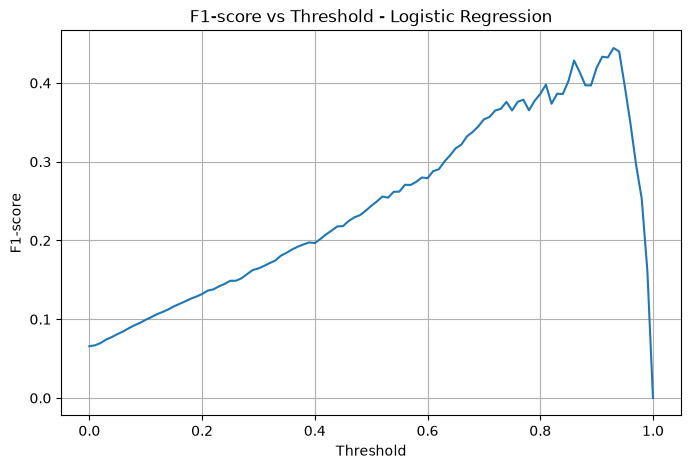
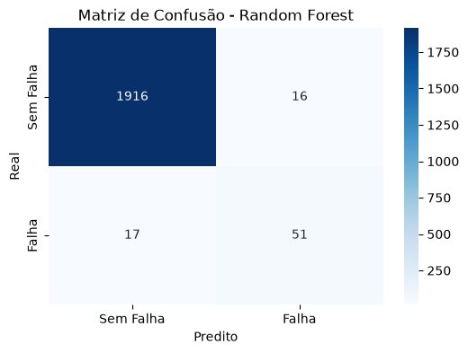

# IoT-Reliability-Monitor

# Análise de Dados e Exploração

### Objetivo

Após a etapa de Análise Exploratória dos Dados (EDA), foi realizada uma análise mais aprofundada com o objetivo de compreender os fatores associados às falhas das máquinas e identificar padrões que possam auxiliar no desenvolvimento de modelos preditivos para monitoramento de confiabilidade.

## Principais Análises Realizadas

### Balanceamento das Classes

Foi verificado que apenas aproximadamente **3,39%** das observações correspondem a falhas de máquina, caracterizando um problema de classificação altamente desbalanceado.

Machine failure
0    96.61
1     3.39

### Distribuição dos Tipos de Máquina

Foi analisada a distribuição das máquinas dos tipos **L**, **M** e **H**, bem como a quantidade e a taxa de falha de cada categoria, permitindo identificar quais grupos apresentam maior propensão à ocorrência de falhas.


### Comparação entre Máquinas com e sem Falha

Foram comparadas estatísticas descritivas (média, mediana e desvio padrão) das principais variáveis entre máquinas que falharam e máquinas em operação normal.

Os resultados indicaram que:

- Máquinas com falha apresentam, em média, valores mais elevados de **Torque**;
- A **Rotational Speed** tende a ser menor nas observações com falha;
- As distribuições dessas variáveis apresentam maior variabilidade quando ocorre uma falha.

### Análise de Correlação

Foi construída uma matriz de correlação entre as variáveis numéricas, excluindo os modos de falha (TWF, HDF, PWF, OSF e RNF) para evitar **data leakage**.

As principais correlações observadas foram:

- **Air Temperature × Process Temperature:** correlação positiva forte (~0.88);
- **Rotational Speed × Torque:** correlação negativa forte (~-0.88).

Esses resultados indicam possíveis relações físicas entre as variáveis e serão considerados durante a etapa de modelagem.


### Análise de Outliers

Foram construídos boxplots para todas as variáveis numéricas.

As maiores concentrações de outliers foram observadas em:

- Rotational Speed
- Torque

Entretanto, esses valores não foram removidos, pois podem representar condições extremas de operação diretamente relacionadas à ocorrência de falhas.

### Probabilidade de Falha

Foi iniciada a análise da probabilidade de falha em função das variáveis operacionais, utilizando agrupamentos em faixas (bins).

As primeiras análises foram realizadas para:

- Torque
- Rotational Speed

Esse tipo de análise permite identificar regiões operacionais com maior risco de falha e fornece informações relevantes para aplicações de manutenção preditiva.

---

## Principais Conclusões

Até o momento, as análises indicam que:

- O conjunto de dados apresenta forte desbalanceamento entre falhas e não falhas;
- O **Torque** demonstra uma associação mais evidente com a ocorrência de falhas;
- Existe uma forte relação inversa entre **Torque** e **Rotational Speed**;
- As temperaturas de processo e ambiente apresentam elevada correlação positiva;
- Os outliers observados representam possíveis condições críticas de operação e, portanto, foram preservados para as próximas etapas.

---

# Modelagem

### **Análises a cerca da escolha do Modelo**

### **Regressão Logística**

A Regressão Logística foi utilizada como modelo inicial para a predição de falhas em sensores IoT, servindo como base de comparação para os demais algoritmos avaliados.

#### **Matriz de Confusão**


No limiar padrão (**threshold = 0,5**), o modelo apresentou **Recall de 88,24%**, demonstrando elevada capacidade de identificar falhas. Entretanto, sua **Precisão foi de apenas 14,15%**, indicando uma grande quantidade de alarmes falsos. Embora poucas falhas reais tenham sido perdidas, o elevado número de falsos positivos torna o modelo pouco viável para utilização em um ambiente industrial.

#### **Ajuste do Threshold**



Com o objetivo de encontrar um melhor equilíbrio entre Precisão e Recall, foi realizado o ajuste do limiar de decisão utilizando o **F1-score** como critério de seleção. O novo threshold aumentou a **Precisão para 60%**, porém reduziu o **Recall para 35,29%**, fazendo com que apenas uma pequena parcela das falhas reais fosse identificada.

Essa análise evidencia o principal desafio da Regressão Logística neste problema: ao reduzir os alarmes falsos, o modelo passa a deixar escapar um número elevado de falhas, comprometendo a confiabilidade do sistema de manutenção preditiva.

#### Conclusão

Os resultados obtidos mostram que a Regressão Logística apresenta dificuldades para equilibrar **Precisão** e **Recall** neste conjunto de dados, indicando que o problema possui relações mais complexas do que um modelo linear consegue representar. Por esse motivo, foi adotado o algoritmo **Random Forest**, que possui maior capacidade de capturar padrões não lineares e fornecer um desempenho mais adequado para a detecção de falhas em sensores IoT.

---

### **Random Forest**

Após as limitações observadas na Regressão Logística, foi adotado o algoritmo **Random Forest**, que apresentou um desempenho significativamente superior na detecção de falhas. O modelo obteve um melhor equilíbrio entre **Precisão**, **Recall** e **F1-score**, reduzindo tanto a ocorrência de alarmes falsos quanto a quantidade de falhas não detectadas, características essenciais para aplicações de monitoramento em ambientes IoT.

#### **Resultados da Validação Cruzada (5-fold):**

> - F1-score (Parte 1): **0,69**
> - F1-score (Parte 2): **0,61**
> - F1-score (Parte 3): **0,73**
> - F1-score (Parte 4): **0,61**
> - F1-score (Parte 5): **0,76**

Para verificar se o modelo apresentava **overfitting**, foi realizada uma **Validação Cruzada (5-fold)**. O Random Forest obteve **F1-score médio de 0,68** com **desvio padrão de 0,06**, indicando baixa variação entre as partições da base de dados. Esses resultados demonstram que o modelo mantém um desempenho consistente em diferentes subconjuntos dos dados, evidenciando boa capacidade de generalização e ausência de indícios relevantes de sobreajuste.


#### **Resultados da Modelagem**



#### **Validação Cruzada**

Para avaliar a capacidade de generalização do modelo, foi aplicada a técnica de **Validação Cruzada (5-fold)**. O Random Forest obteve **F1-score médio de 0,68**, com **desvio padrão de 0,06**, indicando baixa variabilidade entre as diferentes partições da base de dados. Esses resultados sugerem que o modelo apresenta desempenho consistente e não há evidências relevantes de overfitting.

#### **Escolha do Limiar de Decisão**

Após a validação do modelo, foi realizada a análise de diferentes **thresholds** para definir o ponto de operação mais adequado ao problema. O limiar de decisão foi fixado em **0,45**, por apresentar o melhor compromisso entre a identificação de falhas e a redução de alarmes falsos.

```md id="h4k9vf"
| Threshold | Acurácia | Precisão | Recall | Especificidade | F1-score |
|----------:|----------:|----------:|--------:|---------------:|---------:|
| 0.00 | 0.0340 | 0.0340 | 1.0000 | 0.0000 | 0.0658 |
| 0.05 | 0.8850 | 0.2264 | 0.9853 | 0.8815 | 0.3681 |
| 0.10 | 0.9185 | 0.2889 | 0.9559 | 0.9172 | 0.4437 |
| 0.15 | 0.9445 | 0.3757 | 0.9559 | 0.9441 | 0.5394 |
| 0.20 | 0.9510 | 0.4038 | 0.9265 | 0.9519 | 0.5625 |
| 0.25 | 0.9635 | 0.4803 | 0.8971 | 0.9658 | 0.6256 |
| 0.30 | 0.9725 | 0.5619 | 0.8676 | 0.9762 | 0.6821 |
| 0.35 | 0.9770 | 0.6146 | 0.8676 | 0.9808 | 0.7195 |
| 0.40 | 0.9800 | 0.6628 | 0.8382 | 0.9850 | 0.7403 |
| **0.45** | **0.9830** | **0.7125** | **0.8382** | **0.9881** | **0.7703** |
| 0.50 | 0.9840 | 0.7571 | 0.7794 | 0.9912 | 0.7681 |
| 0.55 | 0.9830 | 0.7742 | 0.7059 | 0.9928 | 0.7385 |
| 0.60 | 0.9855 | 0.8545 | 0.6912 | 0.9959 | 0.7642 |
| 0.65 | 0.9845 | 0.8627 | 0.6471 | 0.9964 | 0.7395 |
| 0.70 | 0.9825 | 0.8837 | 0.5588 | 0.9974 | 0.6847 |
| 0.75 | 0.9825 | 0.9459 | 0.5147 | 0.9990 | 0.6667 |
| 0.80 | 0.9790 | 0.9643 | 0.3971 | 0.9995 | 0.5625 |
| 0.85 | 0.9740 | 1.0000 | 0.2353 | 1.0000 | 0.3810 |
| 0.90 | 0.9700 | 1.0000 | 0.1176 | 1.0000 | 0.2105 |
| 0.95 | 0.9675 | 1.0000 | 0.0441 | 1.0000 | 0.0845 |
| 1.00 | 0.9660 | 0.0000 | 0.0000 | 1.0000 | 0.0000 |
```


No limiar de **0,45**, o modelo alcançou **Acurácia de 98,30%**, **Precisão de 71,25%**, **Recall de 83,82%**, **Especificidade de 98,81%** e **F1-score de 77,03%**. Em comparação ao limiar padrão (**0,50**), houve um aumento significativo no Recall (**77,94% → 83,82%**) com impacto mínimo na Precisão (**75,71% → 71,25%**) e um leve aumento no F1-score (**76,81% → 77,03%**).

Essa configuração prioriza a **segurança operacional da fábrica**, garantindo que a maior parte das falhas seja detectada antes de provocar interrupções na produção. Ao mesmo tempo, a elevada Precisão reduz a ocorrência de alarmes falsos, tornando os alertas mais confiáveis para a equipe de manutenção e favorecendo uma estratégia eficiente de manutenção preditiva.