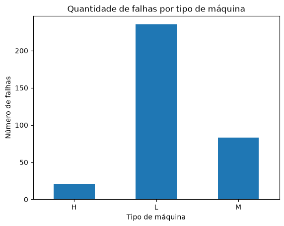
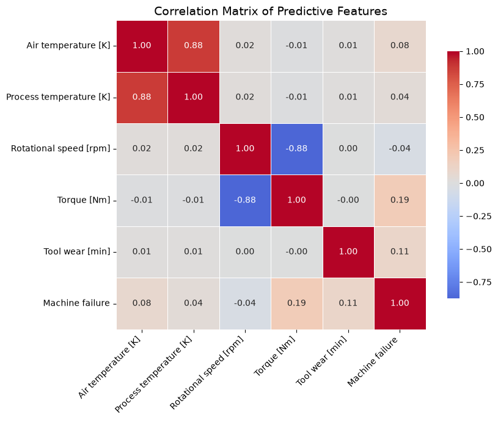

# IoT-Reliability-Monitor

## Data Analysis

### Objetivo

Após a etapa de Análise Exploratória dos Dados (EDA), foi realizada uma análise mais aprofundada com o objetivo de compreender os fatores associados às falhas das máquinas e identificar padrões que possam auxiliar no desenvolvimento de modelos preditivos para monitoramento de confiabilidade.

## Principais Análises Realizadas

### Balanceamento das Classes

Foi verificado que apenas aproximadamente **3,39%** das observações correspondem a falhas de máquina, caracterizando um problema de classificação altamente desbalanceado.

Machine failure
0    96.61
1     3.39

### Distribuição dos Tipos de Máquina

Foi analisada a distribuição das máquinas dos tipos **L**, **M** e **H**, bem como a quantidade e a taxa de falha de cada categoria, permitindo identificar quais grupos apresentam maior propensão à ocorrência de falhas.

### Comparação entre Máquinas com e sem Falha

Foram comparadas estatísticas descritivas (média, mediana e desvio padrão) das principais variáveis entre máquinas que falharam e máquinas em operação normal.

Os resultados indicaram que:

- Máquinas com falha apresentam, em média, valores mais elevados de **Torque**;
- A **Rotational Speed** tende a ser menor nas observações com falha;
- As distribuições dessas variáveis apresentam maior variabilidade quando ocorre uma falha.

### Análise de Correlação

Foi construída uma matriz de correlação entre as variáveis numéricas, excluindo os modos de falha (TWF, HDF, PWF, OSF e RNF) para evitar **data leakage**.

As principais correlações observadas foram:

- **Air Temperature × Process Temperature:** correlação positiva forte (~0.88);
- **Rotational Speed × Torque:** correlação negativa forte (~-0.88).

Esses resultados indicam possíveis relações físicas entre as variáveis e serão considerados durante a etapa de modelagem.

### Análise de Outliers

Foram construídos boxplots para todas as variáveis numéricas.

As maiores concentrações de outliers foram observadas em:

- Rotational Speed
- Torque

Entretanto, esses valores não foram removidos, pois podem representar condições extremas de operação diretamente relacionadas à ocorrência de falhas.

### Probabilidade de Falha

Foi iniciada a análise da probabilidade de falha em função das variáveis operacionais, utilizando agrupamentos em faixas (bins).

As primeiras análises foram realizadas para:

- Torque
- Rotational Speed

Esse tipo de análise permite identificar regiões operacionais com maior risco de falha e fornece informações relevantes para aplicações de manutenção preditiva.

---

## Principais Conclusões

Até o momento, as análises indicam que:

- O conjunto de dados apresenta forte desbalanceamento entre falhas e não falhas;
- O **Torque** demonstra uma associação mais evidente com a ocorrência de falhas;
- Existe uma forte relação inversa entre **Torque** e **Rotational Speed**;
- As temperaturas de processo e ambiente apresentam elevada correlação positiva;
- Os outliers observados representam possíveis condições críticas de operação e, portanto, foram preservados para as próximas etapas.

Esses resultados servirão como base para a etapa de **Modelagem**, onde diferentes algoritmos de Machine Learning serão avaliados para a predição de falhas em equipamentos industriais.